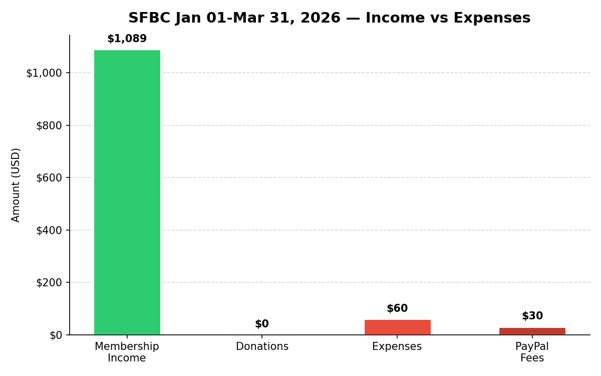
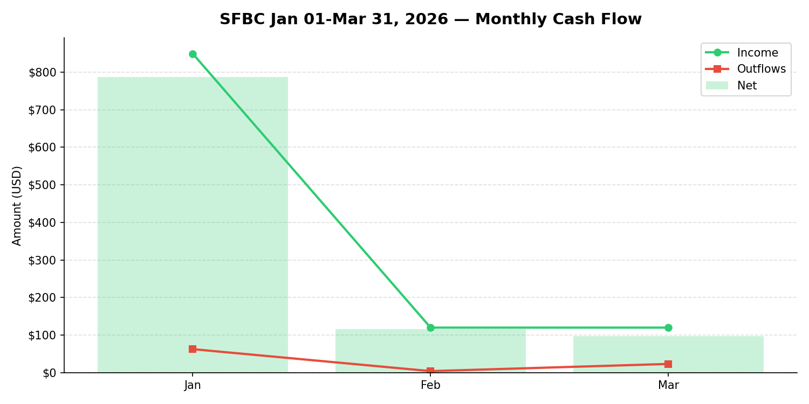
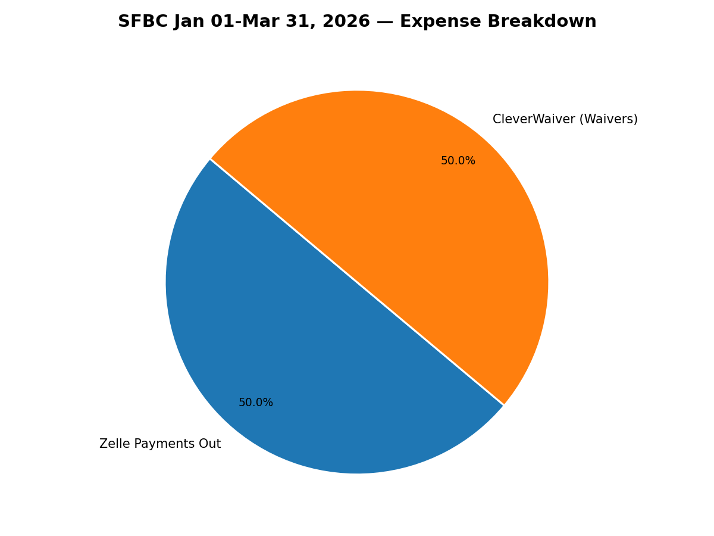

# SFBC Jan 01-Mar 31, 2026 Budget Report

_Generated: April 13, 2026_

---

## Summary

| Metric            | Amount      |
|:------------------|:------------|
| Membership Income | $1,089.00   |
| Donations         | $0.00       |
| Total Income      | $1,089.00   |
| Expenses          | $59.97      |
| PayPal Fees       | $30.29      |
| Total Outflows    | $90.26      |
| **Net Income**    | **$998.74** |

---

## Income Breakdown

### Monthly Income

| Month     | Membership   | Donations   | Total     |
|:----------|:-------------|:------------|:----------|
| January   | $849.00      | $0.00       | $849.00   |
| February  | $120.00      | $0.00       | $120.00   |
| March     | $120.00      | $0.00       | $120.00   |
| **TOTAL** | $1,089.00    | $0.00       | $1,089.00 |

---

## Expense Breakdown

### Monthly Expenses

| Month     | Expenses   |
|:----------|:-----------|
| January   | $39.99     |
| March     | $19.98     |
| **TOTAL** | $59.97     |

### Major Expenses (>$50) with Notes

_No major expenses found._

### Zelle Payments Out

| Date       | Description                        | Amount   | Note   |
|:-----------|:-----------------------------------|:---------|:-------|
| 2026-01-21 | Zelle payment to V*** JPM99c2rhw8l | $30.00   |        |

### All Itemized Expenses

| Date       | Description                                        | Amount   |
|:-----------|:---------------------------------------------------|:---------|
| 2026-01-21 | Zelle payment to V*** JPM99c2rhw8l                 | $30.00   |
| 2026-01-28 | CLEVERWAIVER CLEVERWAIVER. WA                01/28 | $9.99    |
| 2026-03-02 | CLEVERWAIVER CLEVERWAIVER. WA                02/28 | $9.99    |
| 2026-03-30 | CLEVERWAIVER CLEVERWAIVER. WA                03/28 | $9.99    |

---

## PayPal Summary

| Item           | Amount   |
|:---------------|:---------|
| Gross Received | $706.00  |
| Fees           | $30.29   |
| Net            | $675.71  |

---

## Fidelity Investments

**Account:** Z40319360
**Current Portfolio Value:** $14,674.76

### Holdings

| Symbol   | Description                      | Last Price   | Current Value   | Total G/L $   | Total G/L %   | Allocation   |
|:---------|:---------------------------------|:-------------|:----------------|:--------------|:--------------|:-------------|
| SPAXX**  | HELD IN MONEY MARKET             | —            | $1.53           | +$0.00        | +0.00%        | 0.01%        |
| FSKAX    | FIDELITY TOTAL MARKET INDEX FUND | $187.12      | $6,724.71       | +$2,589.06    | +62.60%       | 45.83%       |
| FTIHX    | FIDELITY TOTAL INTL INDEX FUND   | $18.64       | $3,461.61       | +$1,148.50    | +49.65%       | 23.59%       |
| FXNAX    | FIDELITY U.S. BOND INDEX FUND    | $10.49       | $4,486.91       | -$102.38      | -2.24%        | 30.58%       |

---

## Notes

- **Internal transfers excluded:** PayPal <-> Chase ACH transfers are detected and
  excluded from all income/expense totals to avoid double-counting.
- **Date range:** Only transactions with posting dates from **2026-01-01** through **2026-03-31** (inclusive) are included.
- **PayPal fees:** PayPal processing fees are tracked separately and excluded from income.
- **Income classification:** Donations are detected by keywords in the transaction
  description (e.g. donation, benevity). Other positive credits are treated as membership income.
- **Major expenses:** Expenses >= $50 are listed with notes in the Major Expenses section.
- **Name redaction:** Personal names in transaction descriptions have been anonymized.
- **Fidelity:** Portfolio positions are as of the CSV export date and are not mixed
  into operating income or expense figures.
